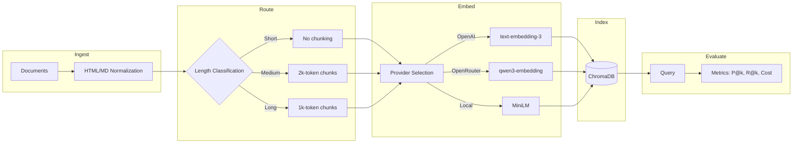

# ContextRAG

[](https://github.com/seanbrar/ContextRAG/actions/workflows/test.yml)
[](https://github.com/seanbrar/ContextRAG/actions/workflows/test.yml)
[](LICENSE)
[](https://github.com/RichardLitt/standard-readme)
[](https://www.python.org/downloads/)

Provider-agnostic RAG evaluation framework with cost-aware embedding selection and reproducible benchmarking.

The framework provides a custom ChromaDB-OpenRouter integration enabling 50–90% embedding cost reduction compared to OpenAI-only pipelines, automatic provider fallback (OpenAI → OpenRouter → local), and YAML-driven evaluation infrastructure for systematic RAG strategy comparison.

## Table of Contents

- [Quickstart (Offline Demo)](#quickstart-offline-demo)
- [Background](#background)
- [Key Features](#key-features)
- [System Architecture](#system-architecture)
- [Install](#install)
- [Production Setup](#production-setup)
- [Usage](#usage)
- [Artifacts](#artifacts)
- [Context Length Management](#context-length-management)
- [Evaluation](#evaluation)
- [Testing](#testing)
- [Engineering Quality](#engineering-quality)
- [Docs](#docs)
- [Results Summary](#results-summary)
- [Future Directions](#future-directions)
- [Related Work](#related-work)
- [Maintainers](#maintainers)
- [Contributing](#contributing)
- [License](#license)

## Quickstart (Offline Demo)

Run a fully offline, deterministic demo using local embeddings:

```bash
poetry run contextrag demo
```

This writes `runs/demo_eval.json` plus `runs/demo_eval/summary.json`,
`runs/demo_eval/per_query.jsonl`, and `runs/demo_eval/manifest.json`.

## Background

ContextRAG provides infrastructure for systematic evaluation of RAG retrieval strategies. The framework addresses two practical challenges in production RAG systems:

1. **Embedding cost management**: Different providers offer varying price/quality tradeoffs. The custom ChromaDB-OpenRouter integration enables cost-aware provider selection with automatic fallback.

2. **Reproducible evaluation**: Comparing chunking strategies requires controlled experiments with comprehensive metrics. The YAML-driven evaluation framework captures accuracy, efficiency, and cost across multiple runs.

### Research Application

The framework was used to test whether **adaptive chunking** - routing documents to different chunk sizes based on length - improves retrieval quality. Rigorous evaluation found no accuracy improvement over uniform chunking (see [Results Summary](#results-summary)), a negative result that simplifies RAG system design.

### Historical Context

The project originated in 2022–2023 when GPT-3.5 (4K context) was significantly cheaper than GPT-3.5-16K, motivating cost-based model routing. As context windows expanded (128K–2M tokens by 2024–2025), the focus shifted to chunking strategies and evaluation infrastructure.

For a detailed technical writeup including methodology and limitations, see [docs/paper.md](docs/paper.md).

## Key Features

- **Provider-Agnostic Embeddings**: Automatic fallback chain (OpenAI → OpenRouter → local) with consistent interface
- **Custom ChromaDB-OpenRouter Integration**: Enables 50–90% embedding cost reduction vs. OpenAI-only pipelines
- **Cost Tracking**: Per-model pricing with index/query cost breakdown for embedding provider comparison
- **Reproducible Evaluation**: YAML-driven configs, efficiency metrics, artifact logging, variance analysis
- **Document Processing Pipeline**: HTML to Markdown conversion, normalization, token counting
- **Length-Based Routing**: Classify documents into short/medium/long categories with configurable thresholds
- **Vector Search**: ChromaDB integration with batched indexing for large corpora
- **Extensible Architecture**: Modular design for testing alternative chunking and routing strategies

## System Architecture

The system implements a five-stage pipeline:



1. **Ingest**: HTML/Markdown normalization and cleaning
2. **Route**: Length-based classification (short/medium/long)
3. **Embed**: Provider-agnostic embedding with automatic fallback
4. **Index**: ChromaDB vector store with batched indexing
5. **Evaluate**: Reproducible benchmarking with efficiency metrics

## Install

Requires Python 3.11 or 3.12.

```bash
# Clone repository
git clone https://github.com/seanbrar/ContextRAG.git
cd ContextRAG

# Install Poetry if you haven't already
curl -sSL https://install.python-poetry.org | python3 -

# Install dependencies using Poetry
poetry install

# Optional: set up environment variables
# cp .env.example .env
```

## Production Setup

Required for embeddings and indexing (OpenAI or OpenRouter):

- `OPENAI_API_KEY` (preferred for OpenAI embeddings)
- `OPENROUTER_API_KEY` (fallback for embeddings and chat)

Note: `--embed-provider openrouter` requires `OPENROUTER_API_KEY`. With `auto`, OpenAI is used when `OPENAI_API_KEY` is set.

Optional (for OpenRouter chat routing or smoke tests):

- `OPENROUTER_BASE_URL` (default: `https://openrouter.ai/api/v1`)
- `OPENROUTER_CHAT_MODEL` (default: `mistralai/devstral-2512:free`)
- `OPENROUTER_EMBEDDINGS_MODEL` (default: `qwen/qwen3-embedding-8b`)
- `CONTEXTRAG_EMBED_PROVIDER` (default: `auto`; options: `openai`, `openrouter`, `local`)
- `LOCAL_EMBEDDINGS_MODEL` (default: `sentence-transformers/all-MiniLM-L6-v2`)
- `OPENROUTER_REFERER` (optional header for OpenRouter rankings)
- `OPENROUTER_TITLE` (optional header for OpenRouter rankings)
- `OPENROUTER_EMBED_PROVIDER_JSON` (optional JSON for OpenRouter provider routing)
- `OPENROUTER_EMBED_PROVIDER_ORDER` (optional comma list for routing order)
- `OPENROUTER_EMBED_ALLOW_FALLBACKS` (optional `true`/`false`)

Model defaults can be overridden:

- `OPENAI_EMBEDDINGS_MODEL` (default: `text-embedding-3-small`)
- `OPENAI_CHAT_MODEL_SHORT` (default: `gpt-3.5-turbo-1106`)
- `OPENAI_CHAT_MODEL_MEDIUM` (default: `gpt-3.5-turbo-16k`)

If you use OpenAI embeddings, set `OPENAI_EMBEDDINGS_MODEL=text-embedding-3-large`.
If you use OpenRouter embeddings, set `OPENROUTER_EMBEDDINGS_MODEL` to a model that supports embeddings
(for example `qwen/qwen3-embedding-8b`).
If you use local embeddings, the model will be downloaded automatically.

For OpenRouter embeddings with short context limits, use chunking:

```bash
poetry run contextrag index --input data/processed --collection contextrag --persist ./runs/chroma --chunk-words 400
```

## Usage

### CLI Quickstart

```bash
# 1) Ingest raw documents into cleaned Markdown
poetry run contextrag ingest --input data/raw --output data/processed --format auto

# 2) Route by length buckets
poetry run contextrag route --input data/processed --output data/routed

# 3) Build a vector index (Chroma)
poetry run contextrag index --input data/processed --collection contextrag --persist ./runs/chroma

# 4) Query the index
poetry run contextrag query --collection contextrag --persist ./runs/chroma --query "token limits"
```

### Doctor

```bash
poetry run contextrag doctor
```

### Python API (selected)

```python
from contextrag.ingest.html_to_markdown import HTMLToMarkdownConverter

converter = HTMLToMarkdownConverter("./my_documents")
converter.convert_all_files(use_target_folder=True)
```

### Example Scripts

Example scripts live in `scripts/`:

- `scripts/html_to_markdown_example.py` — convert HTML to Markdown with routing
- `scripts/vector_store_example.py` — index/query a small in-memory collection

Legacy scripts are preserved in `scripts/legacy/`.

## Demo (No API Keys)

This repo includes a small, public RFC-based dataset under `data/demo` that runs fully offline
using local embeddings (SentenceTransformers). The first run downloads the model.

Run a deterministic evaluation and capture artifacts with explicit options:

```bash
poetry run contextrag eval \
  --dataset data/demo \
  --baseline uniform \
  --k 5 \
  --embed-provider local \
  --output runs/demo_eval.json \
  --run-dir runs/demo_eval
```

This writes `runs/demo_eval.json` plus `runs/demo_eval/summary.json` and
`runs/demo_eval/per_query.jsonl` for inspection.

Example output (local embeddings, `data/demo`):

```
precision@k=0.157 recall@k=0.786 (k=5)
```

Optionally, build an index and query it directly:

```bash
CONTEXTRAG_EMBED_PROVIDER=local poetry run contextrag index \
  --input data/demo/documents \
  --collection demo \
  --persist runs/demo_chroma

CONTEXTRAG_EMBED_PROVIDER=local poetry run contextrag query \
  --collection demo \
  --persist runs/demo_chroma \
  --query "HTTP caching semantics"
```

## Artifacts

Quick map of evaluation outputs:

- `runs/demo_eval.json` — single-file summary (demo run)
- `runs/*/summary.json` — aggregate metrics, timing, and configuration
- `runs/*/per_query.jsonl` — per-query precision/recall and hits
- `runs/*/metadata.json` — dataset and run parameters
- `runs/*/manifest.json` — config hash, dataset fingerprint, versions, system info

## Context Length Management

ContextRAG implements a three-tier routing strategy based on document length:

```
┌────────────────────────────────────────────────────────────┐
│                   Context Length Classification            │
├────────────────┬────────────────────────┬──────────────────┤
│  Short         │  Medium                │  Long            │
│  (≤3500 tokens)│  (3500-15000 tokens)   │  (>15000 tokens) │
├────────────────┼────────────────────────┼──────────────────┤
│  No chunking   │  2000-token chunks     │  1000-token      │
│  (preserve     │  (balance coherence    │  chunks (fine-   │
│  coherence)    │  and granularity)      │  grained search) │
└────────────────┴────────────────────────┴──────────────────┘
```

**Hypothesis**: Adaptive chunking would improve retrieval by preserving semantic coherence in shorter documents while applying appropriate granularity to longer ones.

**Result**: Evaluation shows no accuracy improvement over uniform chunking. See [Results Summary](#results-summary) for details. The routing infrastructure remains useful for experimenting with alternative strategies.

## Evaluation

The evaluation framework compares chunking strategies with comprehensive metrics:

| Metric | Description |
|--------|-------------|
| Precision@k | Fraction of top-k retrieved documents that are relevant |
| Recall@k | Fraction of relevant documents appearing in top-k |
| Efficiency | Chunk count, token usage, indexing time, query latency |
| Cost | Per-model pricing with index/query breakdown (USD) |
| Variance | Multiple runs to verify determinism |

### Cost Comparison

The framework tracks embedding costs to inform provider selection:

| Model | Cost/M tokens | Total Cost | Precision@5 | Recall@5 |
|-------|---------------|------------|-------------|----------|
| text-embedding-3-small | $0.02 | $0.0099 | 0.197 | 0.983 |
| text-embedding-3-large | $0.13 | $0.0643 | 0.200 | 1.000 |

The 6.5× cost difference yields only marginal accuracy improvement (0.3% precision, 1.7% recall).

The eval command expects a dataset directory with `documents/` and `queries.jsonl`.
The `data/demo` dataset in this repo is ready to use:

```bash
poetry run contextrag eval --dataset data/demo --baseline router --k 5 --output runs/eval.json
```

To create a custom RFC-based dataset:

```bash
python scripts/datasets/download_rfc_dataset.py --rfcs 822,9110,9595 --output data/demo/documents
```

You can also run evals from a YAML config:

```bash
poetry run contextrag eval --config experiments/eval_rfc.yaml
```

To capture run artifacts (summary/per-query/metadata), add a run directory:

```bash
poetry run contextrag eval --config experiments/eval_rfc.yaml --run-dir runs/eval_rfc
```

For evaluation protocol details and determinism notes, see:
- `docs/reproducibility.md`
- `docs/evaluation-protocol.md`

## Testing

Run the test suite to verify system functionality:

```bash
pytest tests/
```

## Engineering Quality

This project is designed for production use:

- **95% test coverage** with CI enforcement (`--cov-fail-under=95`)
- **Graceful degradation**: Provider fallback chain ensures operation across environments
- **Batched processing**: Handles large corpora without memory issues
- **Cost observability**: Per-query cost tracking for operational monitoring
- **Reproducibility**: Deterministic evaluation with artifact logging and variance analysis

## Docs

- `docs/architecture.md` — Pipeline stages and data flow
- `docs/design-decisions.md` — Engineering rationale and tradeoffs
- `docs/paper.md` — Academic writeup of the approach
- `docs/results.md` — Evaluation methodology and results
- `docs/reproducibility.md` — Datasets, commands, and artifact structure
- `docs/evaluation-protocol.md` — Step-by-step eval procedure and assumptions

## Results Summary

### Mixed Corpus (Primary Evaluation)

12 documents (3 short, 1 medium, 8 long), 493k tokens, 60 queries, 3 runs:

| Baseline | Precision@5 | Recall@5 | Chunks | Variance |
| -------- | ----------- | -------- | ------ | -------- |
| Uniform  | 0.197       | 0.983    | 499    | 0 (deterministic) |
| Router   | 0.197       | 0.983    | 490    | 0 (deterministic) |

### Key Finding

**Adaptive chunking does not improve retrieval accuracy.** Both strategies achieve identical precision and recall. The router produces 1.8% fewer chunks, but this marginal efficiency gain does not translate to accuracy improvement.

### Interpretation

This negative result is reproducible and informative:

1. **Modern embeddings are robust** — text-embedding-3-small handles chunk boundaries well
2. **Simplicity wins** — uniform chunking is equally effective with less complexity
3. **Original motivation obsolete** — cost-based model routing (GPT-3.5 vs GPT-3.5-16K) is less relevant with modern pricing

### What This Project Demonstrates

- **Rigorous evaluation methodology** with efficiency metrics and variance analysis
- **Provider-agnostic infrastructure** (OpenAI, OpenRouter, local embeddings)
- **Honest reporting** of negative results with clear interpretation

See `docs/results.md` for complete methodology, efficiency breakdowns, and artifact paths.

## Future Directions

Given the negative result on adaptive chunking, potential directions include:

- **Cost-aware routing**: Route to different embedding providers based on cost/quality tradeoffs
- **Hybrid search**: Combine dense embeddings with sparse retrieval (BM25)
- **Alternative chunking strategies**: Semantic chunking, overlapping windows, hierarchical embeddings
- **Benchmark expansion**: Evaluate on standard IR benchmarks (NQ, TriviaQA) for broader validation

Concepts from this project - provider abstraction, batched processing, and cost-aware metrics - informed the author's [Google Summer of Code 2025 project with Google DeepMind](https://github.com/seanbrar/gemini-batch-prediction), which focused on efficient context management for multimodal LLMs.

## Related Work

This project builds upon and extends research in the following areas:

- **Retrieval-Augmented Generation for Knowledge-Intensive NLP Tasks** (Lewis et al., 2020): Introduces the foundational RAG framework combining parametric LLM memory with non-parametric retrieval.
- **Lost in the Middle: How Language Models Use Long Contexts** (Liu et al., 2024): Identifies performance degradation in long contexts, motivating ContextRAG’s focus on high-precision retrieval over simply increasing context window usage.
- **FrugalGPT: How to Use Large Language Models While Reducing Cost and Improving Performance** (Chen et al., 2023): Explores LLM cascades and adaptive model selection to optimize for cost, directly relating to the project's original cost-aware routing goal.
- **RAPTOR: Recursive Abstractive Processing for Tree-Organized Retrieval** (Sarthi et al., 2024): Proposes a hierarchical retrieval method (clustering and summarizing chunks), offering an alternative to the adaptive chunking explored in this project.
- **REPLUG: Retrieval-Augmented Black-Box Language Models** (Shi et al., 2024): Treats LMs as black boxes to optimize retrievers, aligning with the project's provider-agnostic modular architecture.
- **A Systematic Analysis of Chunking Strategies for Reliable Question Answering** (Gomez-Cabello et al., 2024): Provides an evaluation of chunking methods (fixed vs. semantic), providing a formal backbone for the project's findings on embedding robustness.
- **MTEB: Massive Text Embedding Benchmark** (Muennighoff et al., 2023): Establishes the benchmarking standards for text embeddings used in ContextRAG (e.g., text-embedding-3-small).
- **Dense Passage Retrieval for Open-Domain Question Answering** (Karpukhin et al., 2020): Theoretical foundation for the dense vector search (using ChromaDB and modern embeddings) implemented in this framework.

## Maintainers

[Sean Brar](https://github.com/seanbrar) - Project creator and primary maintainer

## Contributing

Contributions to ContextRAG are welcome! Here's how you can help:

- Report bugs by opening an issue
- Suggest enhancements or new features
- Submit pull requests with improvements
- Help with documentation

Please ensure that your contributions adhere to our coding standards and include appropriate tests.

## License

[MIT License](LICENSE)
