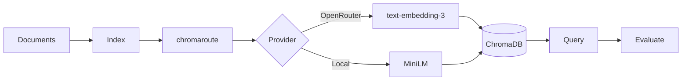

# ContextRAG

[](https://github.com/seanbrar/ContextRAG/actions/workflows/test.yml)
[](https://github.com/seanbrar/ContextRAG/actions/workflows/test.yml)
[](https://www.python.org/downloads/)
[](LICENSE)

RAG evaluation framework demonstrating that **length-based adaptive chunking does not outperform uniform chunking on the committed benchmarks**.

## Project Scope

Core scope (recommended for review/research claims):
- `uniform` vs `router` chunking
- dense retrieval (`retrieval_mode=dense`)
- datasets: `data/eval-expanded`, `data/eval-external`, `data/eval-scifact-mini`

Exploratory scope (kept for follow-up research, not canonical claims):
- semantic chunking, overlap sweeps, BM25/hybrid/rerank retrieval
- hosted cost/quality provider sweeps

## The Research Question

> Does routing documents to different chunk sizes based on length improve RAG retrieval quality?

**Hypothesis**: Short documents (<=3,500 tokens) should remain whole, medium documents (3,501-15,000) should use larger chunks, and long documents (>15,000) should use smaller chunks. A "router" that adapts chunk size to document length should outperform uniform chunking.

## Canonical Finding

Across all committed evaluations, length-based routing **never beats** uniform chunking:

- Mixed corpus + hosted embeddings: **tie** (identical precision@5 and recall@5)
- Core local matrices (`k={3,5,10}`): router is **worse or ties**

Mixed-corpus hosted run slice:

| Strategy | Precision@5 | Recall@5 |
|----------|-------------|----------|
| Uniform chunking | 0.197 | 0.983 |
| Adaptive router | 0.197 | 0.983 |

Scope of this claim:

- Mixed corpus (`data/eval-mixed`): hosted `text-embedding-3-small`, `k=5`, 3 repeated runs
- Expanded mixed (`data/eval-expanded`): local MiniLM matrix, `k={3,5,10}`
- External RFC holdout (`data/eval-external`): local MiniLM matrix, `k={3,5,10}`
- Public SciFact transfer slice (`data/eval-scifact-mini`): local MiniLM matrix, `k={3,5,10}`
- Cost/quality side study: OpenAI `text-embedding-3-small` vs `text-embedding-3-large` (uniform baseline)

## Why This Matters

Within this evaluation scope, routing by document length did not outperform uniform chunking (and sometimes underperformed it). This finding simplifies RAG system design:

- **Use uniform chunking** - simpler baseline with equal or better observed quality
- **Skip adaptive complexity** - no accuracy benefit to justify the cost
- **Focus elsewhere** - retrieval improvements likely come from better embeddings or reranking, not chunk routing

For full methodology, see [docs/paper.md](docs/paper.md).

## Quickstart

```bash
# Install
git clone https://github.com/seanbrar/ContextRAG.git
cd ContextRAG
uv sync --all-extras

# Run offline demo (no API keys needed)
uv run contextrag demo
```

Output: `runs/demo_eval.json` with precision/recall metrics.

## Reproduce Core Study

```bash
# Canonical claim bundle (annotations, matrices, reports, prereg lock)
make reviewer-bundle
```

Primary artifacts:
- `runs/reviewer_bundle/matrix_eval_expanded_local/matrix_summary.json`
- `runs/reviewer_bundle/matrix_eval_external_local/matrix_summary.json`
- `runs/reviewer_bundle/matrix_eval_scifact_local/matrix_summary.json`
- `docs/matrix_eval_expanded_local.md`
- `docs/matrix_eval_external_local.md`
- `docs/matrix_eval_scifact_local.md`
- `docs/preregistration_lock.json`
- `docs/paper_tables.md`

## Build Reviewer Bundle

```bash
make reviewer-bundle
```

This one command regenerates:
- expanded local matrix artifacts and comparisons
- external holdout matrix artifacts and comparisons
- public SciFact transfer matrix artifacts and comparisons
- core annotation rounds + agreement artifacts (`eval-expanded`, `eval-external`)
- preregistration lock metadata (`docs/preregistration_lock.json`)
- `docs/paper_tables.md` (paper-ready aggregate + inference tables)
- `docs/reviewer_bundle.md` (review checklist/report index)

## Exploratory Extensions

Exploratory commands and datasets are documented in
[`docs/exploratory.md`](docs/exploratory.md).

## Dev Helpers

```bash
# Install deps
make install

# Lint, typecheck, tests
make all
```

## CLI Commands

| Command | Description |
|---------|-------------|
| `contextrag core eval` | Claim-aligned single eval (`uniform/router + dense`, core datasets) |
| `contextrag core matrix` | Claim-aligned matrix (`uniform/router × k`, dense, core datasets) |
| `contextrag eval` | Core evaluation (`uniform/router + dense`) with optional exploratory modes |
| `contextrag demo` | Offline evaluation with local embeddings |
| `contextrag matrix` | Run matrix experiments (core and exploratory) |
| `contextrag compare` | Compare two run directories with per-query deltas + inference |
| `contextrag validate-dataset` | Validate dataset/query schema before eval |
| `contextrag artifact-eval` | Rebuild/verify committed artifact checksums |
| `contextrag doctor` | Check configuration health |
| `contextrag db index` | Build vector index from documents |
| `contextrag db query` | Query the vector index |

### Example: Core Evaluation

```bash
# Core eval path (recommended)
uv run contextrag core eval \
    --dataset data/eval-expanded \
    --baseline uniform \
    --k 5 \
    --embed-provider local \
    --output runs/core_eval_uniform_k5.json
```

### Example: Build and Query Index

```bash
# Build index
uv run contextrag db index \
    --input data/demo/documents \
    --collection my_docs \
    --persist ./runs/chroma

# Query
uv run contextrag db query \
    --collection my_docs \
    --persist ./runs/chroma \
    --query "HTTP caching headers"
```

## Configuration

Set environment variables or use `.env`:

```bash
# Embeddings (via chromaroute)
OPENROUTER_API_KEY=sk-or-...        # For hosted embeddings
EMBED_PROVIDER=auto                  # auto | openrouter | local
OPENROUTER_EMBEDDINGS_MODEL=openai/text-embedding-3-small
LOCAL_EMBEDDINGS_MODEL=sentence-transformers/all-MiniLM-L6-v2

# Chat (for future semantic chunking research)
OPENAI_API_KEY=sk-...               # For OpenAI chat
OPENAI_CHAT_MODEL=gpt-4o-mini
CONTEXTRAG_CHAT_PROVIDER=auto       # auto | openai | openrouter
```

Note: direct `embed_provider=openai` is intentionally unsupported for embeddings.
Use OpenAI embedding models through OpenRouter model IDs (for example,
`openai/text-embedding-3-small`).

## Historical Context

This project evolved over 2022–2025:

**2022–2023**: Cost-based model routing. GPT-3.5 (4K context) was significantly cheaper than GPT-3.5-16K, motivating intelligent routing.

**2024**: Context windows expanded to 128K–2M tokens. Focus shifted to chunking strategies.

**2025**: Rigorous evaluation infrastructure revealed the null result. The embedding abstraction was extracted into [chromaroute](https://github.com/seanbrar/chromaroute).

See [docs/evolution.md](docs/evolution.md) for the full journey.

## Architecture



ContextRAG is a CLI tool built on [chromaroute](https://github.com/seanbrar/chromaroute), a provider-agnostic embedding library for ChromaDB.

## Testing

```bash
make test-cov
```

Target: high test coverage with CI gate (`--cov-fail-under=90`).

## Docs

- [docs/paper.md](docs/paper.md) - Full research methodology and results
- [docs/preregistration.md](docs/preregistration.md) - Locked hypotheses, endpoints, and decision rules
- [docs/annotation_protocol.md](docs/annotation_protocol.md) - Dual-annotation and agreement workflow
- [docs/matrix_eval_expanded_local.md](docs/matrix_eval_expanded_local.md) - Latest local matrix dashboard
- [docs/matrix_eval_external_local.md](docs/matrix_eval_external_local.md) - External holdout matrix dashboard
- [docs/matrix_eval_scifact_local.md](docs/matrix_eval_scifact_local.md) - Public SciFact transfer dashboard
- [docs/baseline_study.md](docs/baseline_study.md) - Expanded baseline fairness study
- [docs/paper_tables.md](docs/paper_tables.md) - Generated paper-ready tables
- [docs/reviewer_bundle.md](docs/reviewer_bundle.md) - Reviewer-oriented artifact index
- [docs/preregistration_lock.json](docs/preregistration_lock.json) - Preregistration hash + commit lock
- [docs/evolution.md](docs/evolution.md) - Project history 2022–2025
- [docs/design-decisions.md](docs/design-decisions.md) - Architecture rationale

## Related Work

- [chromaroute](https://github.com/seanbrar/chromaroute) - Provider-agnostic embeddings for ChromaDB (extracted from this project)
- [ChromaDB](https://www.trychroma.com/) - Vector database
- [OpenRouter](https://openrouter.ai/) - Multi-provider API gateway

## License

[MIT](LICENSE)
