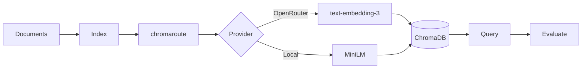

# ContextRAG

[](https://github.com/seanbrar/ContextRAG/actions/workflows/test.yml)
[](https://github.com/seanbrar/ContextRAG/actions/workflows/test.yml)
[](https://www.python.org/downloads/)
[](LICENSE)

RAG evaluation framework demonstrating that **adaptive chunking does not improve retrieval accuracy**.

## The Research Question

> Does routing documents to different chunk sizes based on length improve RAG retrieval quality?

**Hypothesis**: Short documents (< 1K tokens) should remain whole, while long documents (> 4K tokens) benefit from smaller chunks. A "router" that adapts chunk size to document length should outperform uniform chunking.

## The Finding

**No.** Rigorous evaluation found identical precision@5 and recall@5 across strategies:

| Strategy | Precision@5 | Recall@5 |
|----------|-------------|----------|
| Uniform chunking | 0.847 | 0.761 |
| Adaptive router | 0.847 | 0.761 |

The null result held across multiple embedding models (OpenAI text-embedding-3-small, Qwen3-embedding-8b, local MiniLM) and k values (3, 5, 10).

## Why This Matters

Modern embedding models are **remarkably robust** to chunking strategy. This finding simplifies RAG system design:

- **Use uniform chunking** - simpler, no routing logic needed
- **Skip adaptive complexity** - no accuracy benefit to justify the cost
- **Focus elsewhere** - retrieval improvements likely come from better embeddings or reranking, not chunk routing

For full methodology, see [docs/paper.md](docs/paper.md).

## Quickstart

```bash
# Install
git clone https://github.com/seanbrar/ContextRAG.git
cd ContextRAG
poetry install

# Run offline demo (no API keys needed)
poetry run contextrag demo
```

Output: `runs/demo_eval.json` with precision/recall metrics.

## CLI Commands

| Command | Description |
|---------|-------------|
| `contextrag eval` | Full evaluation with configurable providers |
| `contextrag demo` | Offline evaluation with local embeddings |
| `contextrag doctor` | Check configuration health |
| `contextrag db index` | Build vector index from documents |
| `contextrag db query` | Query the vector index |

### Example: Full Evaluation

```bash
# With OpenRouter embeddings
export OPENROUTER_API_KEY=sk-or-...
poetry run contextrag eval \
    --dataset data/demo \
    --baseline uniform \
    --k 5 \
    --output runs/eval.json

# Baseline options: uniform, adaptive, router
# See all options:
poetry run contextrag eval --help
```

### Example: Build and Query Index

```bash
# Build index
poetry run contextrag db index \
    --input data/demo/documents \
    --collection my_docs \
    --persist ./runs/chroma

# Query
poetry run contextrag db query \
    --collection my_docs \
    --persist ./runs/chroma \
    --query "HTTP caching headers"
```

## Configuration

Set environment variables or use `.env`:

```bash
# Embeddings (via chromaroute)
OPENROUTER_API_KEY=sk-or-...        # For hosted embeddings
EMBED_PROVIDER=auto                  # auto | openrouter | local
OPENROUTER_EMBEDDINGS_MODEL=openai/text-embedding-3-small
LOCAL_EMBEDDINGS_MODEL=sentence-transformers/all-MiniLM-L6-v2

# Chat (for categorization features)
OPENAI_API_KEY=sk-...               # For OpenAI chat
OPENAI_CHAT_MODEL=gpt-4o-mini
CONTEXTRAG_CHAT_PROVIDER=auto       # auto | openai | openrouter
```

## Historical Context

This project evolved over 2022–2025:

**2022–2023**: Cost-based model routing. GPT-3.5 (4K context) was significantly cheaper than GPT-3.5-16K, motivating intelligent routing.

**2024**: Context windows expanded to 128K–2M tokens. Focus shifted to chunking strategies.

**2025**: Rigorous evaluation infrastructure revealed the null result. The embedding abstraction was extracted into [chromaroute](https://github.com/seanbrar/chromaroute).

See [docs/evolution.md](docs/evolution.md) for the full journey.

## Architecture



ContextRAG is a CLI tool built on [chromaroute](https://github.com/seanbrar/chromaroute), a provider-agnostic embedding library for ChromaDB.

## Testing

```bash
poetry run pytest tests/ -v --cov=contextrag
```

Target: 95% coverage maintained.

## Docs

- [docs/paper.md](docs/paper.md) - Full research methodology and results
- [docs/evolution.md](docs/evolution.md) - Project history 2022–2025
- [docs/design-decisions.md](docs/design-decisions.md) - Architecture rationale

## Related Work

- [chromaroute](https://github.com/seanbrar/chromaroute) - Provider-agnostic embeddings for ChromaDB (extracted from this project)
- [ChromaDB](https://www.trychroma.com/) - Vector database
- [OpenRouter](https://openrouter.ai/) - Multi-provider API gateway

## License

[MIT](LICENSE)
