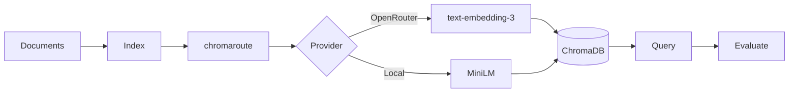

# ContextRAG

[](https://github.com/seanbrar/ContextRAG/actions/workflows/test.yml)
[](https://github.com/seanbrar/ContextRAG/actions/workflows/test.yml)
[](https://www.python.org/downloads/)
[](LICENSE)

RAG evaluation framework for comparing chunking strategies.

ContextRAG is a reproducible benchmarking harness built to answer a specific question: does routing documents to different chunk sizes based on length improve retrieval quality? It grew out of a 2022 chatbot project and evolved into a focused evaluation tool with statistical comparison infrastructure. The answer, on the benchmarks tested, is no -- adaptive chunking does not outperform uniform chunking.

## Quickstart

```bash
# Install
git clone https://github.com/seanbrar/ContextRAG.git
cd ContextRAG
uv sync --all-extras

# Run offline demo (no API keys needed)
uv run contextrag demo
```

Output: `runs/demo_eval.json` with precision/recall metrics.

## What It Does

ContextRAG loads a dataset, chunks documents using a configurable strategy, embeds them with [chromaroute](https://github.com/seanbrar/chromaroute), indexes into ChromaDB, and scores retrieval against ground-truth queries:

- **Metrics**: precision@k, recall@k, nDCG@k, MRR@k, hit@k
- **Statistical comparison**: bootstrap confidence intervals, randomization tests, paired TOST equivalence testing, Cohen's d effect sizes
- **Experiment matrix**: sweep baselines and k values in one command, get per-cell and aggregate reports

## CLI Commands

| Command | Description |
|---------|-------------|
| `contextrag eval` | Run a single evaluation (supports YAML configs) |
| `contextrag demo` | Offline evaluation with local embeddings |
| `contextrag matrix` | Run baseline-by-k experiment matrix |
| `contextrag compare` | Compare two runs with per-query deltas |
| `contextrag validate-dataset` | Validate dataset/query schema |
| `contextrag doctor` | Check configuration health |
| `contextrag db index` | Build vector index from documents |
| `contextrag db query` | Query the vector index |

## Case Study: Adaptive vs Uniform Chunking

The adaptive router classifies documents by token count and assigns chunk sizes accordingly:

| Category | Token Range | Chunking |
|----------|-------------|----------|
| Short | <=3,500 | None (full document) |
| Medium | 3,500-15,000 | 2,000-token chunks |
| Long | >15,000 | 1,000-token chunks |

**Finding: no benefit.** Across three datasets and multiple k values, the router never outperforms uniform 1,000-token chunking -- and sometimes underperforms it. Modern embedding models handle chunk-size variation well enough that length-based routing adds complexity without improving retrieval.

To reproduce: `make reproduce` runs the uniform-vs-router matrix on `data/eval-expanded` with local embeddings.

See [docs/results.md](docs/results.md) for the full matrix and discussion.

## Dataset Format

```
dataset/
├── documents/      # one text file per document
└── queries.jsonl   # {"query": "...", "relevant_ids": ["doc1", "doc2"]}
```

Five datasets are included:

- **`data/demo`** -- minimal 3-document set for smoke testing
- **`data/eval-mixed`** -- mixed-domain corpus with varied document lengths
- **`data/eval-expanded`** -- larger multi-domain corpus used for the primary comparison
- **`data/eval-external`** -- external documents not seen during development
- **`data/eval-scifact-mini`** -- subset of the SciFact benchmark for external validation

## Configuration

YAML configs drive reproducible experiments:

```bash
uv run contextrag eval --config experiments/eval_expanded_uniform_local.yaml
```

Environment variables (or `.env`):

```bash
OPENROUTER_API_KEY=sk-or-...        # For hosted embeddings
EMBED_PROVIDER=auto                  # auto | openrouter | local
LOCAL_EMBEDDINGS_MODEL=sentence-transformers/all-MiniLM-L6-v2
```

## Architecture



Built on [chromaroute](https://github.com/seanbrar/chromaroute), a provider-agnostic embedding library for ChromaDB. For the project's evolution from a 2022 chatbot to this evaluation framework, see [docs/evolution.md](docs/evolution.md).

## Development

```bash
make install    # uv sync --all-extras
make all        # lint + typecheck + tests
make test-cov   # pytest with coverage (90% gate)
```

## Docs

- [docs/results.md](docs/results.md) - Evaluation results and discussion
- [docs/reproducibility.md](docs/reproducibility.md) - How to reproduce evaluations
- [docs/design-decisions.md](docs/design-decisions.md) - Architecture rationale

## Related Work

- [chromaroute](https://github.com/seanbrar/chromaroute) - Provider-agnostic embeddings for ChromaDB (extracted from this project)
- [ChromaDB](https://www.trychroma.com/) - Vector database
- [OpenRouter](https://openrouter.ai/) - Multi-provider API gateway

## License

[MIT](LICENSE)
