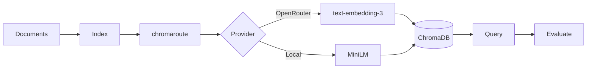

# ContextRAG

[](https://github.com/seanbrar/ContextRAG/actions/workflows/test.yml)
[](https://github.com/seanbrar/ContextRAG/actions/workflows/test.yml)
[](https://www.python.org/downloads/)
[](LICENSE)

RAG evaluation framework for comparing chunking strategies.

## Quickstart

```bash
# Install
git clone https://github.com/seanbrar/ContextRAG.git
cd ContextRAG
uv sync --all-extras

# Run offline demo (no API keys needed)
uv run contextrag demo
```

Output: `runs/demo_eval.json` with precision/recall metrics.

## What It Does

ContextRAG evaluates chunking strategies for retrieval-augmented generation:

```
Dataset -> Chunk -> Embed -> ChromaDB Index -> Query -> Metrics -> Compare
```

1. Load a dataset (documents + queries with ground-truth relevance)
2. Chunk documents using a configurable strategy (uniform, adaptive router, semantic)
3. Embed chunks via [chromaroute](https://github.com/seanbrar/chromaroute) (OpenRouter or local models)
4. Index into ChromaDB and run queries
5. Calculate precision@k, recall@k, nDCG@k, MRR@k, hit@k
6. Compare strategies with statistical tests (bootstrap CI, randomization, effect sizes)

## CLI Commands

| Command | Description |
|---------|-------------|
| `contextrag eval` | Run a single evaluation (supports YAML configs) |
| `contextrag demo` | Offline evaluation with local embeddings |
| `contextrag matrix` | Run baseline-by-k experiment matrix |
| `contextrag compare` | Compare two runs with per-query deltas |
| `contextrag validate-dataset` | Validate dataset/query schema |
| `contextrag doctor` | Check configuration health |
| `contextrag db index` | Build vector index from documents |
| `contextrag db query` | Query the vector index |

## Case Study: Adaptive vs Uniform Chunking

We used this framework to test whether routing documents to different chunk sizes based on length improves retrieval quality. The adaptive router classifies documents by token count:

| Category | Token Range | Chunking |
|----------|-------------|----------|
| Short | <=3,500 | None (full document) |
| Medium | 3,500-15,000 | 2,000-token chunks |
| Long | >15,000 | 1,000-token chunks |

**Finding: no benefit.** Across three datasets and multiple k values, the router never outperforms uniform 1,000-token chunking -- and sometimes underperforms it. Modern embedding models appear robust to simple length-based chunk routing.

See [docs/results.md](docs/results.md) for the full matrix and discussion.

## Dataset Format

```
dataset/
├── documents/      # one text file per document
└── queries.jsonl   # {"query": "...", "relevant_ids": ["doc1", "doc2"]}
```

Five datasets are included: `data/demo`, `data/eval-mixed`, `data/eval-expanded`, `data/eval-external`, `data/eval-scifact-mini`.

## Configuration

YAML configs drive reproducible experiments:

```bash
uv run contextrag eval --config experiments/eval_expanded_uniform_local.yaml
```

Environment variables (or `.env`):

```bash
OPENROUTER_API_KEY=sk-or-...        # For hosted embeddings
EMBED_PROVIDER=auto                  # auto | openrouter | local
LOCAL_EMBEDDINGS_MODEL=sentence-transformers/all-MiniLM-L6-v2
```

## Reproduce the Comparison

```bash
make reproduce
```

This runs the uniform-vs-router matrix on `data/eval-expanded` with local embeddings.

## Architecture



Built on [chromaroute](https://github.com/seanbrar/chromaroute), a provider-agnostic embedding library for ChromaDB.

## Development

```bash
make install    # uv sync --all-extras
make all        # lint + typecheck + tests
make test-cov   # pytest with coverage (90% gate)
```

## Docs

- [docs/results.md](docs/results.md) - Evaluation results and discussion
- [docs/reproducibility.md](docs/reproducibility.md) - How to reproduce evaluations
- [docs/evolution.md](docs/evolution.md) - Project history (2022-2025)
- [docs/design-decisions.md](docs/design-decisions.md) - Architecture rationale

## Related Work

- [chromaroute](https://github.com/seanbrar/chromaroute) - Provider-agnostic embeddings for ChromaDB (extracted from this project)
- [ChromaDB](https://www.trychroma.com/) - Vector database
- [OpenRouter](https://openrouter.ai/) - Multi-provider API gateway

## License

[MIT](LICENSE)
